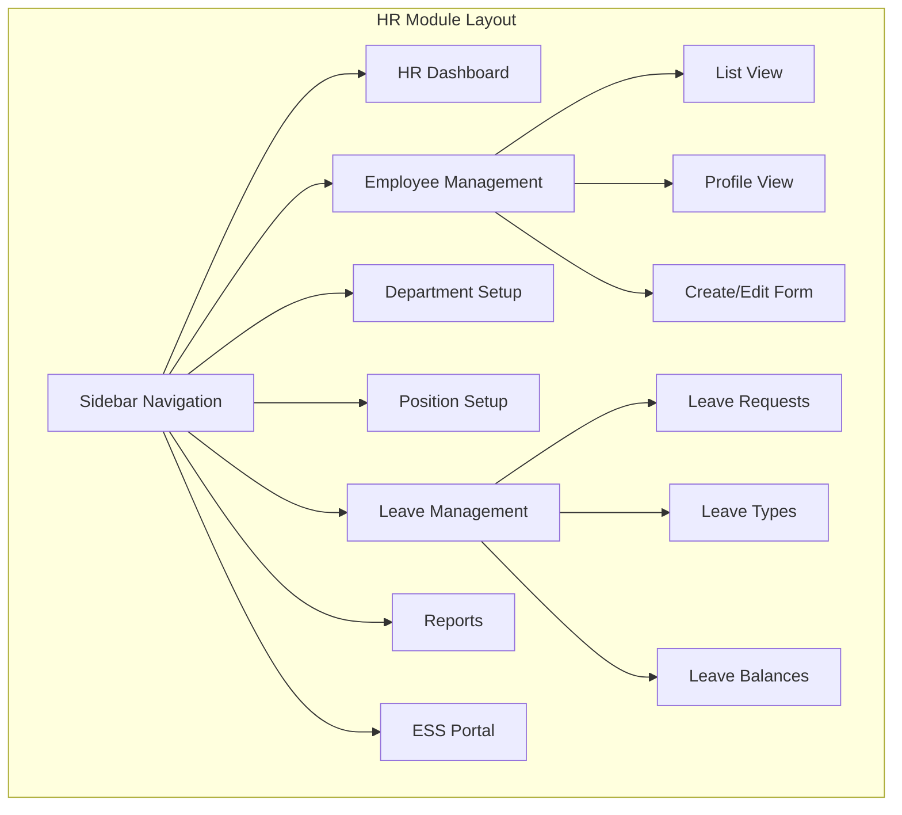

# Modern HR Module for LGU System

## Project Overview

This document outlines the comprehensive architectural plan for implementing a modern Human Resources (HR) module in the existing Laravel-based LGU (Local Government Unit) system. The module will provide complete employee management capabilities with self-service features.

---

## 1. Executive Summary

The HR module will be a comprehensive system designed to manage employee records, departments, organizational structure, leave requests, and employee self-service capabilities. It aligns with the existing system architecture using Laravel 10+ conventions, Livewire components for interactivity, and Blade templates for rendering.

---

## 2. Current System Analysis

### Existing Components
- **EmployeeInfo Model**: Basic employee data (id, employee_id, email, names, birthday, gender, contact, address, hire_date, contract dates, employee_group, designation, remarks, biometrics_no, rate_per_day, department_id)
- **Department Model**: Basic department structure (department_name, dep_code, dep_desc, category, sector, rank_order, pay_name, pay_full)
- **HumanResourcesController**: Minimal implementation with only `create()` and `store()` methods
- **Views**: Basic create form at `resources/views/modules/hr/create.blade.php`
- **Routes**: Limited to `/employee-info/create` and `/employee-info/store`

### Identified Gaps
1. No employee listing/dashboard view
2. No employee edit/update functionality
3. No employee profile view
4. No department management interface (beyond admin)
5. No leave management system
6. No employee self-service portal
7. No attendance tracking
8. No organizational chart visualization
9. No position/job title management

---

## 3. Proposed Module Architecture

### 3.1 Module Structure

```
app/
├── Http/
│   ├── Controllers/
│   │   └── HR/
│   │       ├── EmployeeController.php       # Employee CRUD operations
│   │       ├── DepartmentController.php     # Department management
│   │       ├── PositionController.php       # Position/Job title management
│   │       ├── LeaveController.php          # Leave request management
│   │       └── EmployeeSelfServiceController.php # ESS portal
│   └── Livewire/
│       └── HR/
│           ├── EmployeeList.php              # Employee listing with filters
│           ├── EmployeeProfile.php           # Employee profile view
│           ├── LeaveRequest.php              # Leave request form
│           └── OrgChart.php                  # Organizational chart
├── Models/
│   ├── HR/
│   │   ├── Position.php                     # Job positions
│   │   ├── LeaveType.php                    # Types of leave
│   │   ├── LeaveRequest.php                  # Leave applications
│   │   └── EmployeeDocument.php             # Employee documents
│   └── EmployeeInfo.php                     # (existing - enhance)
│   └── Department.php                       # (existing - enhance)
```

### 3.2 Database Schema Design

#### New Tables Required

| Table | Purpose | Key Fields |
|-------|---------|------------|
| `hr_positions` | Job titles and positions | position_name, department_id, salary_grade, description, is_active |
| `hr_leave_types` | Types of leave available | leave_name, leave_code, max_days_per_year, is_paid, requires_approval |
| `hr_leave_requests` | Leave applications | employee_id, leave_type_id, start_date, end_date, reason, status, approver_id |
| `hr_employee_documents` | Employee document storage | employee_id, document_type, file_path, uploaded_at |
| `hr_employee_positions` | Employee position history | employee_id, position_id, start_date, end_date, is_current |

#### Existing Table Enhancements

**departments table**
- Add: `parent_department_id` (self-referencing for hierarchy)
- Add: `head_employee_id` (department head)
- Add: `budget_allocation`
- Add: `location`

**employee_info table**
- Add: `profile_photo_path`
- Add: `civil_status`
- Add: `citizenship`
- Add: `blood_type`
- Add: `emergency_contact_name`
- Add: `emergency_contact_phone`
- Add: `sss_number`
- Add: `philhealth_number`
- Add: `pagibig_number`
- Add: `tin_number`
- Add: `bank_account_number`
- Add: `employment_status` (regular, casual, contract, job order)
- Add: `employee_type` (permanent, temporary, part-time)

---

## 4. Feature Specifications

### 4.1 Employee Management

#### Employee List View
- Tabular display with columns: Employee ID, Name, Department, Position, Employment Status, Hire Date
- Search functionality (by name, employee ID, department)
- Filter by: Department, Employment Status, Employee Type
- Sort by any column
- Pagination (20/50/100 per page)
- Export to CSV/Excel
- Bulk actions (export, deactivate)

#### Employee Profile View
- Personal Information section (all personal details)
- Employment Information section (hire date, position, department, employment status)
- Government IDs section (SSS, PhilHealth, Pag-IBIG, TIN)
- Bank Information section
- Emergency Contacts section
- Document Attachments section
- Position History timeline
- Leave Balance summary

#### Employee Create/Edit Form
- Multi-step form wizard:
  1. Personal Information
  2. Employment Details
  3. Government IDs
  4. Bank Details
  5. Documents Upload
- Inline validation
- Auto-generate employee ID option
- Department/Position dropdowns with search

### 4.2 Department Management

- Department listing with hierarchy visualization
- Create/Edit Department form
- Assign department head
- Department personnel list
- Department statistics (employee count, budget)
- Organizational structure tree view

### 4.3 Position Management

- Position masterlist
- Create/Edit Position form
- Link position to department
- Salary grade assignment
- Position requirements/qualifications

### 4.4 Leave Management

#### Leave Types Configuration
- Define leave types (Vacation, Sick, Maternity, Paternity, Solo Parent, etc.)
- Set annual allocation per type
- Configure approval workflow

#### Leave Request Process
- Employee submits leave request
- Select leave type, dates, reason
- Attach supporting documents
- View leave balance before applying
- Manager approval workflow
- Email notifications
- Leave calendar view

#### Leave Reports
- Leave balances report
- Leave utilization report
- Leave history per employee

### 4.5 Employee Self-Service (ESS) Portal

#### Employee Dashboard
- Welcome message with employee name
- Quick stats: Leave balances, pending requests, announcements
- Recent activity timeline

#### My Profile
- View personal information
- Edit personal details (limited fields)
- Upload/change profile photo
- View employment details

#### Leave Requests
- Submit new leave request
- View request status
- Cancel pending requests
- View leave history
- Download leave forms

#### Announcements
- Company-wide announcements
- HR policies and memos

---

## 4.6 Module Access Control (RBAC)

### Access Level Management
- Define system modules (HR, BPLS, RPT, Treasury, Admin, etc.)
- Assign access levels per employee
- Role-based permissions (View, Create, Edit, Delete, Approve)

### Module Access Features
- **Module Assignment**: Each employee can be assigned access to specific modules
- **Permission Levels**:
  - No Access
  - View Only
  - View + Create
  - View + Create + Edit
  - Full Access (View + Create + Edit + Delete + Approve)
- **Department-based Access**: Auto-assign module access based on department
- **Access Logs**: Track module access per employee

### Implementation
- **hr_modules** table: Define all available system modules
- **hr_employee_modules** table: Link employees to modules with permissions
- **Access Middleware**: Check employee permissions before allowing module access
- **Admin Interface**: Manage module assignments per employee

#### Database Tables

| Table | Purpose | Key Fields |
|-------|---------|-------------|
| `hr_modules` | System modules list | module_name, module_slug, module_description, is_active, category |
| `hr_employee_modules` | Employee module access | employee_id, module_id, access_level, assigned_by, assigned_at |
| `hr_access_logs` | Access tracking | employee_id, module_id, action, ip_address, timestamp |

---

## 5. User Interface Design

### 5.1 Layout Structure



### 5.2 Component Library

Using existing Tailwind CSS and Blade components:
- **Tables**: Sortable, searchable, paginated tables (similar to BPLS module)
- **Forms**: Multi-step wizard with validation
- **Cards**: Statistics cards for dashboard
- **Modals**: For quick actions and confirmations
- **Charts**: For reports and visualizations
- **File Upload**: Drag-and-drop document upload
- **Date Pickers**: For date range selections

### 5.3 Color Scheme

Following the existing application theme:
- Primary: Indigo/Blue tones
- Success: Green (approvals, active status)
- Warning: Yellow (pending status)
- Danger: Red (rejections, errors)
- Gray: Disabled/inactive states

---

## 6. API/Route Structure

### 6.1 Routes Configuration

```php
// HR Module Routes
Route::prefix('hr')->name('hr.')->group(function () {
    // Dashboard
    Route::get('/dashboard', [DashboardController::class, 'index'])->name('dashboard');
    
    // Employee Management
    Route::prefix('employees')->name('employees.')->group(function () {
        Route::get('/', [EmployeeController::class, 'index'])->name('index');
        Route::get('/create', [EmployeeController::class, 'create'])->name('create');
        Route::post('/', [EmployeeController::class, 'store'])->name('store');
        Route::get('/{employee}', [EmployeeController::class, 'show'])->name('show');
        Route::get('/{employee}/edit', [EmployeeController::class, 'edit'])->name('edit');
        Route::put('/{employee}', [EmployeeController::class, 'update'])->name('update');
        Route::delete('/{employee}', [EmployeeController::class, 'destroy'])->name('destroy');
        Route::post('/{employee}/documents', [EmployeeController::class, 'uploadDocument'])->name('documents.upload');
    });
    
    // Department Management
    Route::prefix('departments')->name('departments.')->group(function () {
        Route::get('/', [DepartmentController::class, 'index'])->name('index');
        Route::post('/', [DepartmentController::class, 'store'])->name('store');
        Route::put('/{department}', [DepartmentController::class, 'update'])->name('update');
        Route::delete('/{department}', [DepartmentController::class, 'destroy'])->name('destroy');
    });
    
    // Position Management
    Route::prefix('positions')->name('positions.')->group(function () {
        Route::get('/', [PositionController::class, 'index'])->name('index');
        Route::post('/', [PositionController::class, 'store'])->name('store');
        Route::put('/{position}', [PositionController::class, 'update'])->name('update');
        Route::delete('/{position}', [PositionController::class, 'destroy'])->name('destroy');
    });
    
    // Leave Management
    Route::prefix('leaves')->name('leaves.')->group(function () {
        Route::get('/requests', [LeaveController::class, 'requests'])->name('requests');
        Route::post('/requests/{request}/approve', [LeaveController::class, 'approve'])->name('approve');
        Route::post('/requests/{request}/reject', [LeaveController::class, 'reject'])->name('reject');
        Route::get('/types', [LeaveController::class, 'types'])->name('types');
        Route::post('/types', [LeaveController::class, 'storeType'])->name('types.store');
    });
    
    // Reports
    Route::prefix('reports')->name('reports.')->group(function () {
        Route::get('/employees', [ReportController::class, 'employees'])->name('employees');
        Route::get('/leaves', [ReportController::class, 'leaves'])->name('leaves');
        Route::get('/departments', [ReportController::class, 'departments'])->name('departments');
    });
    
    // Module Access Control
    Route::prefix('module-access')->name('module-access.')->group(function () {
        Route::get('/', [ModuleAccessController::class, 'index'])->name('index');
        Route::get('/employee/{employee}', [ModuleAccessController::class, 'employeeModules'])->name('employee');
        Route::post('/employee/{employee}/assign', [ModuleAccessController::class, 'assignModule'])->name('assign');
        Route::post('/employee/{employee}/revoke', [ModuleAccessController::class, 'revokeModule'])->name('revoke');
        Route::get('/logs', [ModuleAccessController::class, 'accessLogs'])->name('logs');
    });
});

// Employee Self-Service Routes (for employees)
Route::prefix('my-hr')->name('my-hr.')->group(function () {
    Route::get('/dashboard', [EmployeeSelfServiceController::class, 'dashboard'])->name('dashboard');
    Route::get('/profile', [EmployeeSelfServiceController::class, 'profile'])->name('profile');
    Route::put('/profile', [EmployeeSelfServiceController::class, 'updateProfile'])->name('profile.update');
    Route::get('/leave', [EmployeeSelfServiceController::class, 'leave'])->name('leave');
    Route::post('/leave/request', [EmployeeSelfServiceController::class, 'submitLeaveRequest'])->name('leave.submit');
});
```

---

## 7. Implementation Phases

### Phase 1: Foundation (Week 1)
- [ ] Create database migrations for new tables
- [ ] Create Position model and migration
- [ ] Create LeaveType model and migration
- [ ] Create LeaveRequest model and migration
- [ ] Create EmployeeDocument model and migration
- [ ] **Create Module Access Control tables (hr_modules, hr_employee_modules, hr_access_logs)**
- [ ] Update EmployeeInfo model with new fields
- [ ] Update Department model with hierarchy fields

### Phase 2: Module Access Control (Week 2)
- [ ] Create hr_modules seeder with system modules (HR, BPLS, RPT, Treasury, Admin, GIS)
- [ ] Create ModuleAccess model and migration
- [ ] Create AccessLog model for tracking
- [ ] Create ModuleAccessController for managing permissions
- [ ] Create middleware for checking module access
- [ ] Create module assignment interface in admin panel
- [ ] Implement access logging for audit trail

### Phase 3: Core Employee Management (Week 3)
- [ ] Enhance HumanResourcesController with full CRUD
- [ ] Create Employee list view with search/filter
- [ ] Create Employee profile view
- [ ] Create Employee create/edit form (multi-step)
- [ ] Implement file upload for profile photos

### Phase 4: Department & Position Setup (Week 4)
- [ ] Create Department management interface
- [ ] Create Position management interface
- [ ] Implement organizational chart visualization

### Phase 5: Leave Management (Week 5)
- [ ] Create LeaveType configuration
- [ ] Implement leave request submission
- [ ] Implement leave approval workflow
- [ ] Create leave balance tracking
- [ ] Create leave reports

### Phase 6: Employee Self-Service (Week 6)
- [ ] Create ESS dashboard
- [ ] Create My Profile page
- [ ] Create Leave request submission
- [ ] Add announcements section

### Phase 7: Testing & Refinement (Week 7)
- [ ] Unit testing
- [ ] Integration testing
- [ ] User acceptance testing
- [ ] Bug fixes and improvements
- [ ] Documentation

---

## 8. Technical Considerations

### 8.1 Performance Optimization
- Use Lazy Loading for large employee lists
- Implement database indexing on frequently queried columns
- Cache department and position lists
- Use Livewire's pagination for large datasets

### 8.2 Security
- Role-based access control (RBAC) for HR functions
- File upload validation and sanitization
- Input sanitization for all forms
- Audit logging for sensitive operations

### 8.3 Integration Points
- Maintain compatibility with existing User authentication
- Use existing notification system for leave approvals
- Export capabilities for reports

---

## 9. Success Metrics

- Employee management CRUD operations working
- Department hierarchy visualization functional
- Leave request and approval workflow complete
- Employee self-service portal operational
- **Module access control per employee functional**
- All views responsive and mobile-friendly
- Code follows Laravel best practices

---

## 10. Deliverables

1. Database migrations for all new tables
2. Eloquent models for all HR entities
3. Controllers with full CRUD operations
4. Blade views for all pages
5. Route configuration
6. Basic styling consistent with existing theme
7. This planning document
8. **Module Access Control System**:
   - hr_modules, hr_employee_modules, hr_access_logs tables
   - ModuleAccess and AccessLog models
   - ModuleAccessController
   - Access middleware
   - Admin interface for permission management
9. **Access Logs** for audit trail

---

*Document Version: 1.0*
*Created: February 2026*
*System: LGU GreatV2 Laravel Application*
